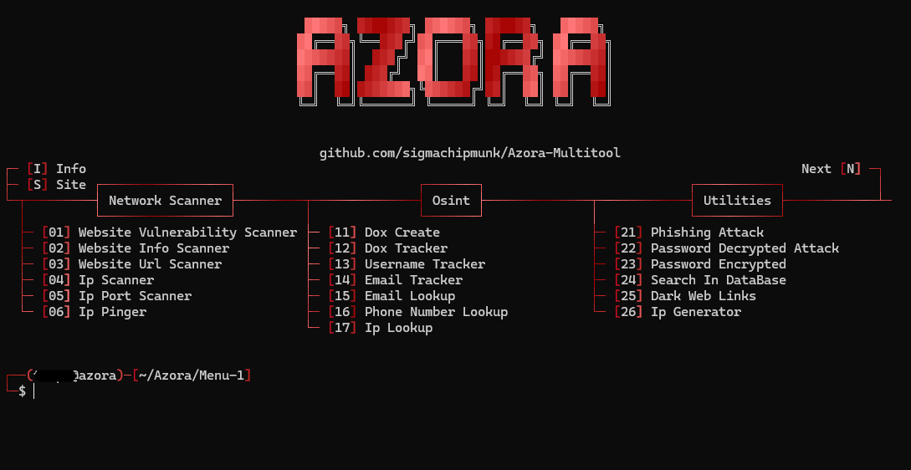
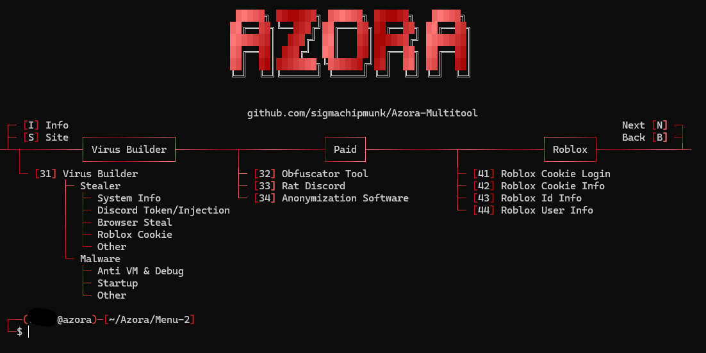
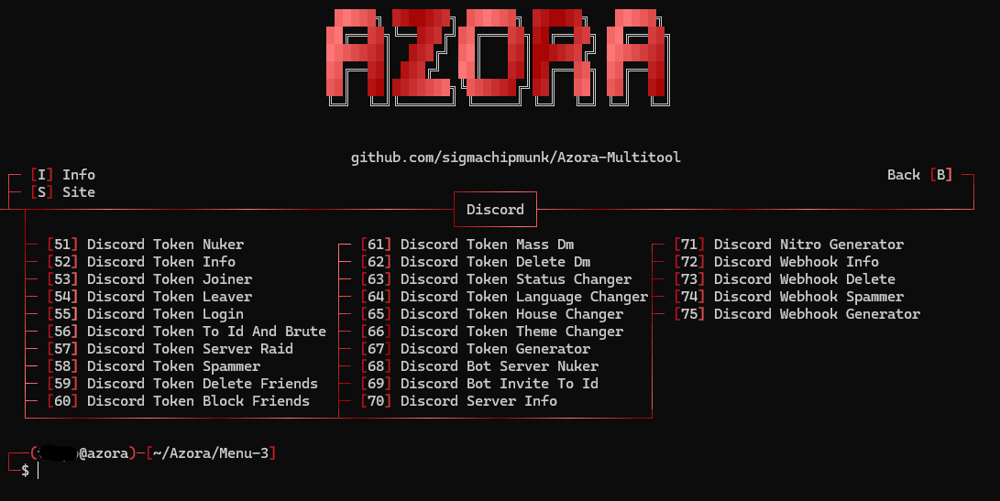

<h1 align="center">Azora Multi-Tools</h1>

<p align="center">
   <a href="https://discord.gg/RsuR3DWzj5">Discord</a>
</p>

<p>
  
  - Developed in <strong>Python</strong>, by <a href="https://discord.gg/RsuR3DWzj5">Auora and Skibidivro</a><br>
  - Tool in <strong>English</strong>.<br>
  - Available on <strong>Windows 11 and 10</strong><br>
  - <strong>No malware</strong> or <strong>backdoor</strong>.<br>
  - <strong>Open Source</strong><br>
  - <strong>Frequently updated</strong>.<br>
  - <strong>Free</strong> for everyone.<br>
  - The tools include: <strong>Scanning, Osint, Utilities, Builder, Roblox, Discord</strong>, And more..
  - Installation and requirements <a href=https://github.com/sigmachipmunk/Azora-Multitool/tree/main#requirements>Found here</a>
  <br><br>
</p>

<h1 align="center">Tools</h1>

<p align="center">
   
   
   
  <br><br>
</p>
<h1 align="center">WARNING⚠️</h1>
<P>
   It has come to my attention that there is a <bold>infected clone</bold> of our multitool. After further anaylsis, it is obfuscated lua malware. I do NOT recommend running it as it may be a rat, stealer, or ransomware. Please note that you are getting our multitool from <a href="https://github.com/sigmachipmunk/Azora-Multitool/">here</a> as this is the offical repository

   On the other hand, make sure that you NEVER download it from <a href="https://github.com/roindroid/Azora-Multitool">here</a>. I unfortunately not quick and this has been going on for around a month. It is still active as it has updated 15 minutes ago. To conclude this warning, there is an infected clone and you should not download it.

   
   
</P>
<h1 align="center">Features</h1>
<p>
   
```
┌── ⚒️ - Azora-Multi-Tools
│   ├── Info
│   └── Site
│
├── 🕵️‍♂️ - Network Scanner
│   ├── Sql Vulnerability Scanner
│   ├── Website Scanner
│   ├── Website Url Scanner
│   ├── Ip Scanner
│   ├── Ip Port Scanner
│   └── Ip Pinger
│
├── 🔎 - Osint
│   ├── Dox Create
│   ├── Dox Tracker
│   ├── Username Tracker
│   ├── Email Tracker
│   ├── Email Lookup
│   ├── Phone Number Lookup
│   └── Ip Lookup
│
├── 🔧 - Utilities
│   ├── Phishing Attack
│   ├── Password Decrypted Attack
│   ├── Password Encrypted
│   ├── Search In DataBase
│   ├── Dark Web Links
│   └── Ip Generator
│
├── ☠️ - Virus Builder
│   ├── Stealer
│   │   ├── System Info: User, System, Ip, Disk, Screen, Location, etc.
│   │   ├── Discord Token: Token, Email, Phone, Id, Username, etc.
│   │   ├── Discord Injection: Email/Password Changed, Login, Card/Paypal Added, Nitro Bought, etc.
│   │   ├── Browser Steal: Passwords, History, Cookies, Downloads, Cards, etc.
│   │   ├── Roblox Cookie: Cookie, Id, Username, etc.
│   │   ├── Camera Capture: Record the victim's computer camera.
│   │   └── Screenshot: Capture the victim's computer screen.
│   │
│   └── Malware
│       ├── Block Key
│       ├── Block Mouse
│       ├── Block Task Manager
│       ├── Block AV Website
│       ├── Shutdown
│       ├── Spam Open Program
│       ├── Spam Create File
│       ├── Fake Error
│       ├── Launch At Startup
│       ├── Anti Vm & Debug
│       └── Restart Every 5min
│
├── 📞 - Discord Tools
│   ├── Token Discord
│   │   ├── Discord Token Info
│   │   ├── Discord Token Nuker
│   │   ├── Discord Token Joiner
│   │   ├── Discord Token Leaver
│   │   ├── Discord Token Login
│   │   ├── Discord Token To Id And Brute
│   │   ├── Discord Token Server Raid
│   │   ├── Discord Token Spammer
│   │   ├── Discord Token Delete Friends
│   │   ├── Discord Token Block Friends
│   │   ├── Discord Token Mass Dm
│   │   ├── Discord Token Delete Dm
│   │   ├── Discord Token Status Changer
│   │   ├── Discord Token Language Changer
│   │   ├── Discord Token House Changer
│   │   ├── Discord Token Theme Changer
│   │   └── Discord Token Generator
│   │
│   ├── Bot Discord
│   │   ├── Discord Bot Server Nuker
│   │   └── Discord Bot Invite To Id
│   │
│   ├── Webhook Discord
│   │   ├── Discord Webhook Info
│   │   ├── Discord Webhook Delete
│   │   ├── Discord Webhook Spammer
│   │   └── Discord Webhook Generator 
│   │
│   ├── Discord Server Info
│   └── Discord Nitro Generator
│
└── 🎮 - Roblox Tools
    ├── Roblox Cookie Login
    ├── Roblox Cookie Info
    ├── Roblox User Info
    └── Roblox Id Info


```
<br><br>
</p>

<h1 align="center">Requirements</h1>

<h3>Windows:</h3>

<p>
- Install <a href="https://www.python.org/downloads/">Python</a> with the <a href="Img/Python_Path.png">PATH</a> options.<br>
- Windows 10 or 11
</p>


<h1 align="center">Installation</h1>

<a href="https://github.com/sigmachipmunk/Azora-Multitool/archive/refs/heads/main.zip">Download "Azora-Multi-Tool.zip" Here</a>

<p>
  
```
1 - Download the .zip folder.
2 - Unzip the folder.
3 - Launch "Setup.bat".
```
<br><br>
</p>

<h1 align="center">Disclaimer</h1>

<p>
  
  - Azora Multi-Tool has been developed solely for educational purposes.<br>
  - This project has been created with good intentions and is intended for personal use only.<br>
  - By choosing to use Azora Multi-Tool, you acknowledge and accept full responsibility for any consequences that may result from your actions.<br>
  - All scripts in the "<a href="https://github.com/sigmachipmunk/Azora-Multitool/tree/main/Settings/Program/FileDetectedByAntivirus">Settings/Program/FileDetectedByAntivirus</a>" folder are <strong>detected by antiviruses</strong> but pose no threat to you. These are <strong>not backdoors or malware</strong>.
<br><br>
</p>

<h1 align="center">Donation</h1>
<p>
If you wish to support our team, you can do so by joining the <a href="https://discord.gg/RsuR3DWzj5">Discord server</a> where we have many other utilities, cheats, etc 

  
</p>

</p>
